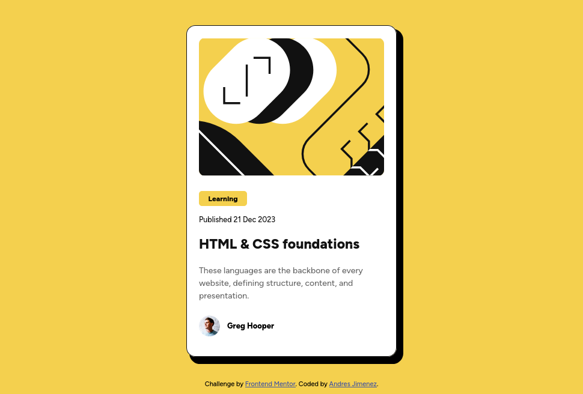

# Frontend Mentor - Blog preview card solution

This is a solution to the [Blog preview card challenge on Frontend Mentor](https://www.frontendmentor.io/challenges/blog-preview-card-ckPaj01IcS). Frontend Mentor challenges help you improve your coding skills by building realistic projects. 

## Table of contents

- [Overview](#overview)
  - [The challenge](#the-challenge)
  - [Screenshot](#screenshot)
  - [Links](#links)
- [My process](#my-process)
  - [Built with](#built-with)
  - [What I learned](#what-i-learned)
  - [Continued development](#continued-development)
- [Author](#author)

## Overview

### The challenge

Users should be able to:

- See hover and focus states for all interactive elements on the page

### Screenshot

### Links

- Solution URL: [https://blog-preview-cardaj.netlify.app/](https://blog-preview-cardaj.netlify.app/)
- Live Site URL: [Add live site URL here](https://your-live-site-url.com)

## My process

### Built with

- Semantic HTML5 markup
- CSS custom properties
- Flexbox

### What I learned

This challenge allowed me to review the basic concepts of HTML and CSS, such as positioning, tags, styles, among others.

### Continued development

I will continue with challenges similar to this one to continue strengthening the basics of HTML and CSS.

## Author

- Frontend Mentor - [@andresj24](https://www.frontendmentor.io/profile/andresj24)
- Twitter - [@AndresitoJ96](https://x.com/AndresitoJ96)

